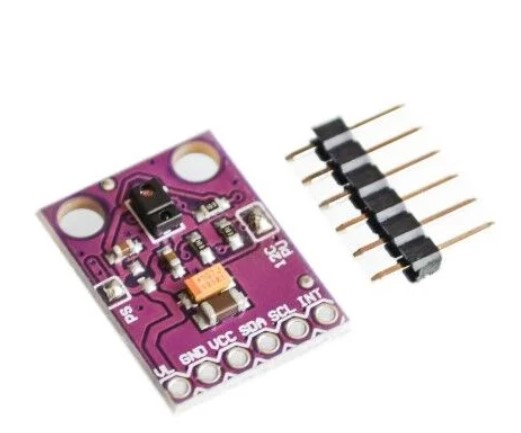
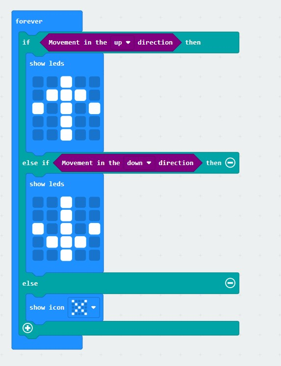

# Robotistan APDS-9960 Sensor

makecode APDS-9960 package for micro:bit  

Author: Selim  
Date:   2023 August 
  


## Add extension

open your microbit makecode project, in Extension, paste  

[https://github.com/makecode-extensions/i2cLCD1602  
](https://github.com/selimgayretli/pxt-rbt)
to search box then search.

## Basic usage

```
let item = 0
I2C_LCD1602.LcdInit(0)
I2C_LCD1602.ShowString("Hello", 0, 0)
basic.forever(() => {
    item += 1
    I2C_LCD1602.ShowNumber(item, 0, 1)
    basic.pause(1000)
})
```


## I2C Address  
- PCF8574: 39  
- PCF8574A: 63  
- Auto: 0

## API

- LcdInit(Addr: number)  
Initial APDS-9960  


- APDS-9960 Light Value
  
- APDS-9960 Distance (cm or inches)
  
- APDS-9960 RGB Color
  
- Movement in the Direction
  


## Demo



## License

MIT

Copyright (c) 2023, microbit/micropython Chinese community  

## Supported targets

* for PXT/microbit


[From microbit/micropython Chinese community](https://www.micropython.org.cn)
